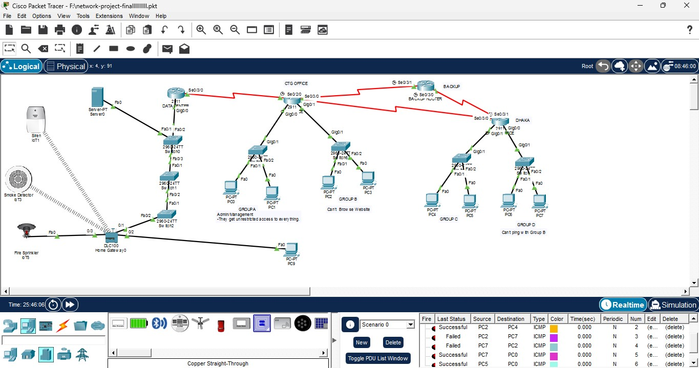
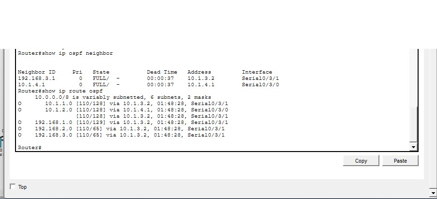
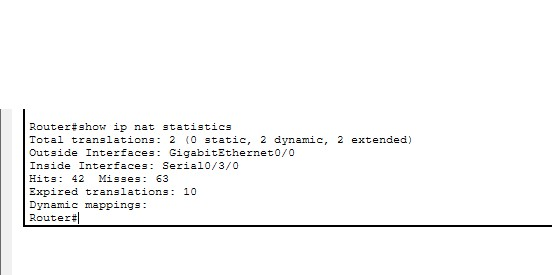
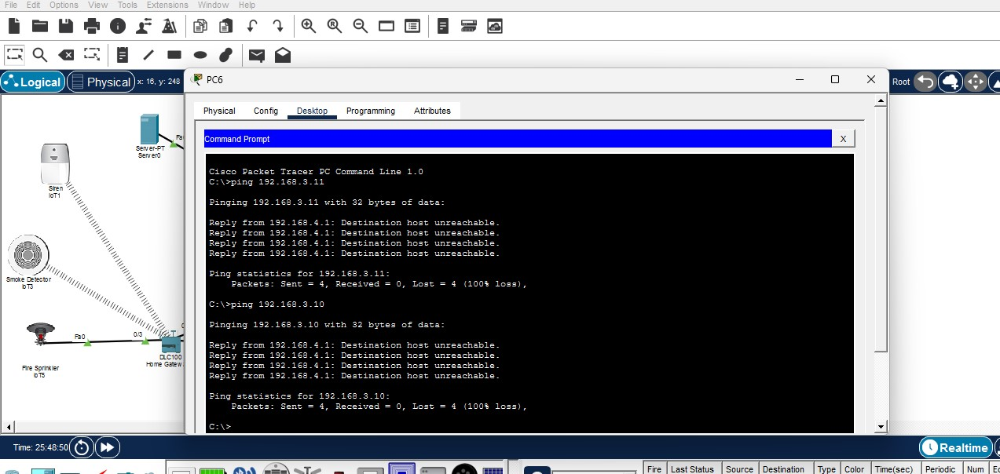
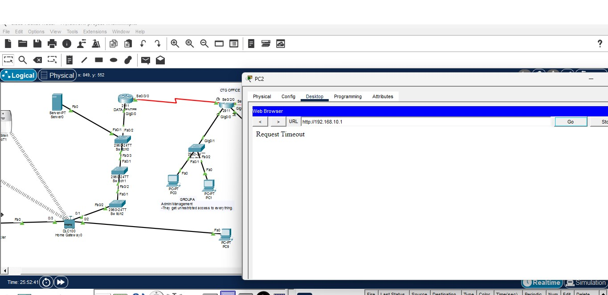
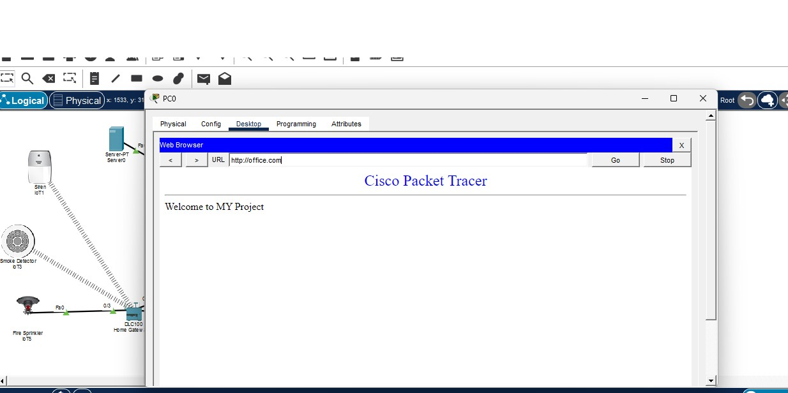
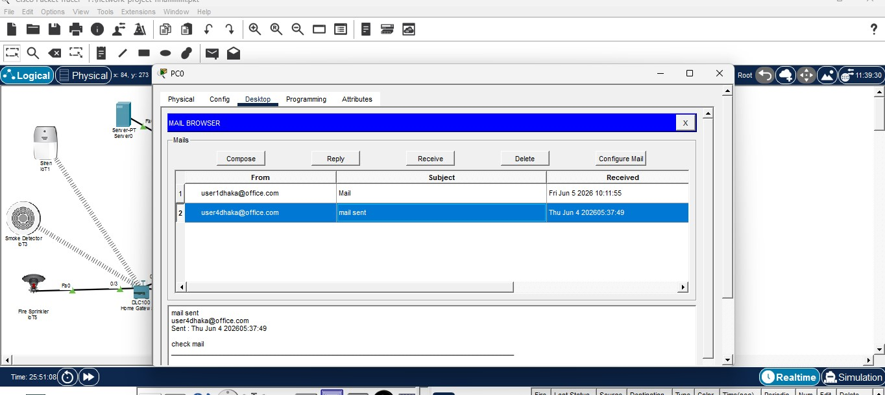

# Enterprise Hybrid Network Infrastructure: OSPF Routing, Core Network Services, & Automated Data Center IoT

An enterprise-grade network infrastructure designed and simulated within **Cisco Packet Tracer**. This project demonstrates an advanced implementation of multi-area dynamic routing, rigid border security policies, centralized network services, and an automated Internet of Things (IoT) hazard response loop engineered for data center safety.

---

## 🗺️ Topology Overview
The network architecture represents a resilient, multi-segmented corporate network split into distinct structural zones connected via a high-availability routing core:

* **Core Routing Backbone:** Powered by dynamic OSPF routing to maintain redundant paths and fluid connectivity across all remote branches and central nodes.
* **Corporate & Administrative Zones:** Segmented subnets (Group A, Group B, Group C) accommodating corporate endpoints, administrative management PCs, and network endpoints.
* **Enterprise Server Farm:** A highly protected data storage and utility hub hosting crucial application-layer services (Web, Domain, and Mail processing).
* **Industrial IoT Safety Zone:** A specialized data center environment containing smart sensors and emergency responders connected via an automated wireless gateway.

**Figure 1:** *Global Enterprise Hybrid Network Topology Layout*

---

## 🛠️ Key Technical Implementations & Protocols

### 1. Dynamic Routing & Core Infrastructure
* **OSPF (Open Shortest Path First):** Configured as the core dynamic routing protocol across all routers. It ensures rapid convergence, dynamic path selection, and full inter-subnet reachability across the entire enterprise layout.

**Figure 2:** *CLI Output - OSPF Neighbor Adjacencies and Routing Table Validation*

* **NAT (Network Address Translation):** Implemented at the network perimeter to translate private internal IP addresses into public-facing IPs. This secures internal node structures from external exposure while managing clean data progression to outside zones.

**Figure 3:** *CLI Output - Active Dynamic NAT Translation Pools and Inside/Outside State Interchanges*

### 2. Network Security & Traffic Control
* **ACL (Access Control Lists):** Engineered strict standard and extended IP packet filters. These lists segment administrative boundaries, lock down access to sensitive server farms, enforce data isolation policies, and prevent unauthorized cross-subnet communication.

**Figure 4:** *Traffic Control - Security Policy Deployment via Access Control Lists*

**Figure 5:** *Simulation Mode - Extended ACL Explicit Deny and Packet Drop Verification*

### 3. Centralized Application & Network Services
* **DHCP (Dynamic Host Configuration Protocol):** Configured automated dynamic IP address allocation across all local subnets, allowing endpoints and wireless IoT systems to fetch network configurations instantly.
* **DNS (Domain Name System):** Deployed centralized hostname resolution, mapping readable domain entries to back-end server IPs so client endpoints can access internal services seamlessly.
* **HTTP (Hypertext Transfer Protocol):** Configured functional web servers to host corporate portals, enabling authorized workstations to browse internal intranet sites.

**Figure 6:** *Application Layer - Client Workstation HTTP Intranet Portal Access via Browser*

* **Enterprise Email Engine:** Implemented an SMTP/POP3 mail server environment with dedicated domain management to simulate automated network alerts and organizational communications.

**Figure 7:** *Communications - Enterprise SMTP/POP3 Mail Account Validation and Delivery Sync*

### 4. Industrial IoT Automation Matrix
The localized smart logic engine monitors environmental vectors inside the data center node and executes immediate safety actions based on the following automated state machine:

| Condition Trigger (IF) | Threshold | Action Executed (THEN) | Safety State |
| :--- | :--- | :--- | :--- |
| **Smoke Detector (IoT3)** | `>= 0.3` Level | Siren (**IoT1**) ➔ **ON**   Fire Sprinkler (**IoT5**) ➔ **ON** | **Active Hazard Mode** |
| **Smoke Detector (IoT3)** | `<= 0.1` Level | Siren (**IoT1**) ➔ **OFF**   Fire Sprinkler (**IoT5**) ➔ **OFF** | **Safe Baseline Mode** |

**Figure 8:** *Smart Automation - Localized IoT Gateway Condition Rules and Threshold Profiles*

> **Design Note:** The rules incorporate specific activation and recovery gaps (hysteresis logic) to protect hardware components from rapid power cycling or flickering during edge readings.

---

## 💻 How to Run the Simulation
1. Download and open the `office-network-design.pkt` file in **Cisco Packet Tracer** (v8.2 or higher recommended).
2. Ensure the environment is toggled to **Realtime Mode** in the bottom-left corner.
3. **Execute Fire Drill Test:** Hold the `Alt` key and click on the **Smoke Detector (IoT3)** to introduce smoke particles. Watch the synchronous siren flash and sprinkler deployment activate.
4. **Verify Application Services:** Open any client workstation, navigate to the **Web Browser**, and input your configured domain name to verify DNS-to-HTTP mapping.
